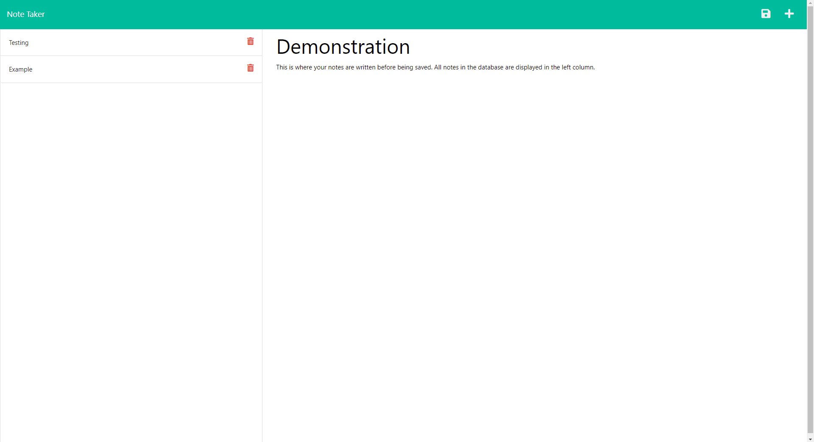

# Note Taker
  

  ## Description

  This web app uses express.js to create a server that serves a website to take and notes. Any notes the user creates and saves are then stored in the db.json file as a (stringified) array of objects. Each object has a title and text property, given by the frontend, and a unique ID property, created by the uuid node module. To communicate with the backend, GET, POST, and DELETE methods have been set up. This app was made to practice backend development for a programming bootcamp through the University of Washington. The frontend files were provided, but the backend - server.js - was written by Phoenix Staley.
  
  ## Table of contents
  
  1. [Usage](#usage)
  2. [Contribution](#contribution)
  3. [License](#license)
  4. [Questions](#questions)
  
  ## Usage
  
  To use this application, simply visit the [live website](https://afternoon-wildwood-14118.herokuapp.com/) hosted on Heroku. Once you've opened the app, click "Get Started" to load the notes page. This page will load all the notes saved in the database. You can write the title and content of a note and press the save icon in the top right-hand corner of the page to push your note onto the database. To start a new note, press the + button in the same corner. To view previously saved notes, click on the note you wish to view in the left column. Next to each of these notes, you can press the red garbage can icon to delete the given note, removing it from the database.

  
  
  ## Contribution
  
  If you would like to make any contributions to this app, please email me. The developer(s) contact information is in the [Questions](#questions) section.

  ## License

  Copyright (c) 2022 Phoenix Staley

      Permission is hereby granted, free of charge, to any person obtaining
      a copy of this software and associated documentation files (the
      "Software"), to deal in the Software without restriction, including
      without limitation the rights to use, copy, modify, merge, publish,
      distribute, sublicense, and/or sell copies of the Software, and to
      permit persons to whom the Software is furnished to do so, subject to
      the following conditions:
      
      The above copyright notice and this permission notice shall be
      included in all copies or substantial portions of the Software.
      
      THE SOFTWARE IS PROVIDED "AS IS", WITHOUT WARRANTY OF ANY KIND,
      EXPRESS OR IMPLIED, INCLUDING BUT NOT LIMITED TO THE WARRANTIES OF
      MERCHANTABILITY, FITNESS FOR A PARTICULAR PURPOSE AND
      NONINFRINGEMENT. IN NO EVENT SHALL THE AUTHORS OR COPYRIGHT HOLDERS BE
      LIABLE FOR ANY CLAIM, DAMAGES OR OTHER LIABILITY, WHETHER IN AN ACTION
      OF CONTRACT, TORT OR OTHERWISE, ARISING FROM, OUT OF OR IN CONNECTION
      WITH THE SOFTWARE OR THE USE OR OTHER DEALINGS IN THE SOFTWARE.
  
  ## Questions
  
  If you have a question or want to report a bug, you can email the developers [here](mailto:PhoenixStaley_Developer@outlook.com).
  This code was created by Phoenix Staley. To see more work by them, check out their [Github profile](https://github.com/Phoenix-Staley).